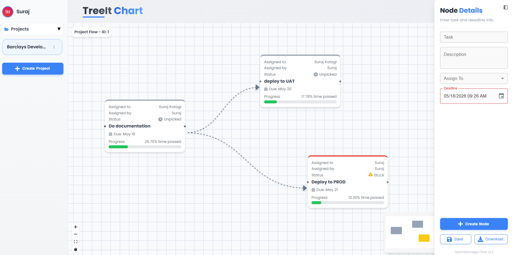

# 🧠 Tree It — Visual Task Management Architecture

**Tree It** is a full-stack, node-based task management system that reimagines workflow planning. Instead of static lists, it allows users to visualize tasks, map dependencies, and track complex project hierarchies using interactive graphs powered by [React Flow](https://reactflow.dev/).



---

## 🎯 The Problem It Solves

Traditional task managers (like Jira or Trello) often lose the "big picture" context of how subtasks relate to parent goals. **Tree It** solves this by treating task management as a dependency graph.

**Key Innovation:** Automatic Status Propagation. When a user marks all child subtasks as `Completed`, the parent node automatically evaluates its dependency tree and updates its own status accordingly, ensuring project managers always see the true state of a workflow.

---

## ✨ Core Features

- **Interactive Node Interface:** Drag, drop, and connect task dependencies visually.
- **Smart State Management:** Automatic parent status propagation based on child node completion.
- **Inline Node Editing:** Update Task Name, Assignee, Deadline, and Status directly on the canvas.
- **Dynamic Theming:** Node borders and backgrounds react dynamically to their current state (`unpicked`, `in-progress`, `completed`).
- **Persistent Architecture:** Real-time saving and loading of node coordinates and edge relationships via REST API.
- **Export Engine:** One-click conversion of the active graph into a high-res `.png` using `html-to-image`.

---

## 🏗️ System Architecture

This project uses a separated, modern three-tier architecture to ensure clean separation of concerns.

### Frontend (React.js)

- **Canvas Engine:** `React Flow` manages the coordinate system, viewport rendering, and edge connections.
- **Component Design:** Built using stateless UI components and smart container logic (Separation of Concerns).
- **Styling:** Custom CSS combined with Framer Motion for smooth route transitions and UI feedback.
- **State:** Managed via React Hooks (`useState`, `useEffect`, `useCallback`) to handle complex graph data structures.

### Backend (Spring Boot / Java)

- **Framework:** Spring Boot handles the RESTful API endpoints (`GET /load`, `POST /save`).
- **Data Handling:** Implements Data Transfer Objects (DTOs) to safely serialize complex React Flow node structures (X/Y coordinates, node data payloads, edge connections) into the database.
- **CORS Management:** Fully configured to accept cross-origin requests from the deployed React frontend.

### Database (PostgreSQL on Neon.tech)

- **Infrastructure:** Serverless PostgreSQL deployed on [Neon](https://neon.tech/).
- **Schema:** Relational tables mapping standard task data (assignee, deadlines) to their mathematical graph properties (source nodes, target nodes, UI coordinates).

---

## 🔐 Guest Login

Want to explore without setting up locally? Use the guest credentials below:

| Field    | Value      |
| -------- | ---------- |
| Username | `Test`     |
| Password | `Test#123` |

---

## 🚀 Local Development Setup

To run this project locally, you will need both the frontend and backend running simultaneously.

### 1. Database Configuration

1. Set up a PostgreSQL database (locally or via a cloud provider like Neon).
2. Add your database credentials to the backend configuration file or environment variables.

### 2. Backend (Spring Boot)

Ensure your Java environment is set up.

```bash
cd backend
./mvnw spring-boot:run
# The server will start on http://localhost:2999
```

### 3. Frontend (React)

Open a new terminal window:

```bash
git clone https://github.com/yourusername/tree-it.git
cd tree-it
npm install
npm start
# The app will open at http://localhost:3000
```

---

## 📂 Key File Structure

```plaintext
src/
├── components/         # Reusable, stateless UI building blocks
│   ├── auth/           # Segmented logic for login/registration
│   ├── ui/             # Generic wrappers, loaders, and layout components
│   └── utility/        # API base instances and notification handlers
├── pages/              # Smart containers (Home, Login) managing data fetching
├── services/           # Extracted API call logic (Separation of Concerns)
├── App.js              # Application routing hub
└── index.js            # Root render
```

---

## 🔮 Roadmap

- [ ] **Role-Based Access Control (RBAC):** Implementing JWT authentication for secure multi-tenant projects.
- [ ] **Overdue Alerts:** Integrating a cron job to flag nodes with red borders if the datetime-local passes without completion.
- [ ] **WebSocket Integration:** Moving from REST to WebSockets for real-time multiplayer collaboration.

---

## 🧑‍💻 Author

Engineered by **Suraj Kotagi** — Feel free to explore the code, open issues, or connect on LinkedIn.
